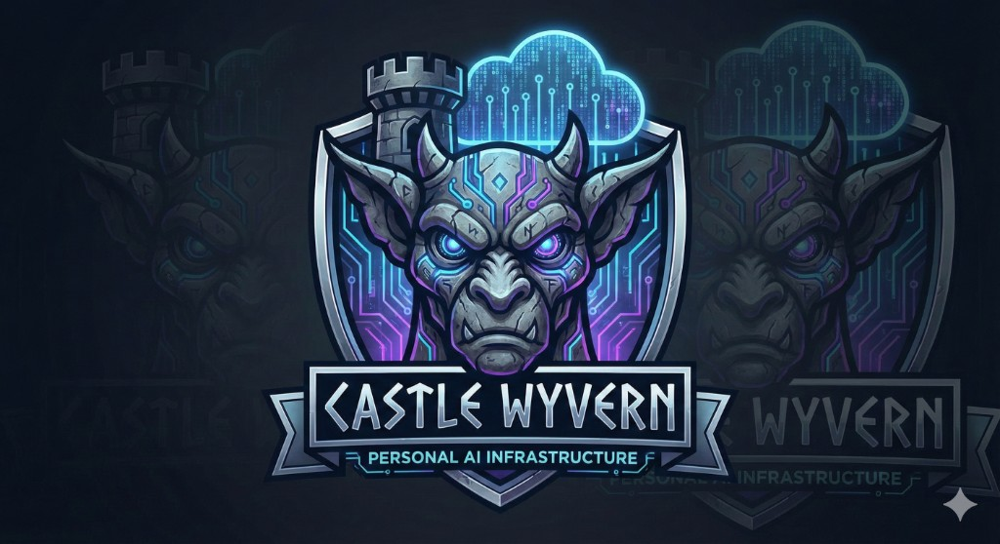

# Castle Wyvern

## A Decentralized Multi-Agent AI Infrastructure

**Project Castle Wyvern** is a hardware-agnostic, modular framework for building a personal AI infrastructure. It bridges local "Stone" nodes (Desktops/Laptops) with "Cloud" keeps to create a resilient, private, and agentic assistant ecosystem.

> "One thousand years ago, superstition and the sword ruled. It was a time of darkness. It was a world of fear. It was the age of gargoyles."


[](https://openclaw.ai)

<p align="center">
  
</p>

---

## Works with OpenClaw

Castle Wyvern complements [OpenClaw](https://openclaw.ai) — the multi-channel AI assistant (Telegram, WhatsApp, Discord). **OpenClaw** = conversational front-end; **Castle Wyvern** = technical infrastructure (CLI, API, multi-agent system). Use them together for chat-anywhere, execute-everywhere workflows.

**Setup and examples:** [docs/openclaw.md](docs/openclaw.md)

---

## What's unique

- **KAG over RAG** — A **Knowledge-Assisted Graph (KAG)** drives logical reasoning over structured facts and relationships, not just vector similarity. Use it for "why" and "how" questions, consistency checks, and multi-hop inference.
- **Self-organizing agent coordination** — The clan uses a **match → exchange → execute → score** loop: tasks get matched to an optimal team, agents exchange context, execute, and get scored so the system learns who does what best.
- **MCP + A2A in one stack** — Model Context Protocol (MCP) tools and Agent-to-Agent (A2A) workflows live in the same codebase. One CLI and API for tools, memory, reasoning, and multi-agent coordination.

---

## The Manhattan Clan

| Agent   | Role        | Specialty                          |
|---------|-------------|------------------------------------|
| Goliath | Leader      | High-level reasoning, orchestration |
| Lexington | Technician | Code, automation, technical execution |
| Brooklyn | Strategist | Multi-path planning, architecture  |
| Broadway | Chronicler | Documentation, summarization       |
| Hudson  | Archivist   | Historical context, long-term memory |
| Bronx   | Watchdog    | Security monitoring, alerts        |
| Elisa   | Bridge      | Human context, ethics, legal       |
| Xanatos | Red Team    | Adversarial testing, vulnerabilities |
| Demona  | Failsafe    | Error prediction, worst-case scenarios |
| Jade    | Web Surfer  | Autonomous web browsing, research  |

---

## Quick Start

```bash
git clone https://github.com/GenieWeenie/castle-wyvern.git
cd castle-wyvern

pip install -r requirements.txt
# Or: pip install -e ".[run]"   # install package with runtime deps

cp .env.example .env
# Edit .env with your API keys (Z.ai, OpenAI optional)

python castle_wyvern_cli.py
```

### Optional features

| Feature          | Install                                      | Usage |
|------------------|----------------------------------------------|--------|
| **Local LLM (Ollama)** | `pip install ollama` or `pip install -e ".[local]"` | Set `OLLAMA_HOST` in `.env`. Use `mode=local` for Phoenix Gate. |
| **RAG (vector search)** | `pip install faiss-cpu chromadb` or `pip install -e ".[rag]"` | Enables vector memory and semantic search. |

---

## Using the CLI

```bash
python castle_wyvern_cli.py
```

**Commands:** `ask <question>` · `code <description>` · `review <code>` · `summarize <text>` · `plan <description>` · `status` · `health` · `members` · `help` · `quit`

**Example:** `code Write a function to calculate fibonacci` → routed to Lexington; returns code.

---

## API

The REST API (default port **18791**) exposes clan, memory, KAG, coordination, and BMAD. Start with the CLI (`api-start`) or `python -m eyrie.api_server`.

```bash
# No auth required
curl -s http://localhost:18791/health | jq

# With API key (if configured)
curl -s -H "X-API-Key: YOUR_KEY" http://localhost:18791/status | jq
curl -s -X POST http://localhost:18791/clan/ask -H "Content-Type: application/json" -H "X-API-Key: YOUR_KEY" \
  -d '{"question": "How do I structure a Python project?"}' | jq
```

**Full examples:** [docs/api-examples.md](docs/api-examples.md) — health, status, clan/ask, memory, kg/reason, coord/team, BMAD.

---

## Project Structure

```
castle-wyvern/
├── bmad/              # BMAD Method (quick_spec, dev_story, code_review, product_brief)
├── eyrie/             # Phoenix Gate, intent router, API server, plugins, security, etc.
├── grimoorum/         # Memory
├── tests/             # Test suite (117 tests)
├── docs/              # Architecture, API examples, features, roadmap
├── castle_wyvern_cli.py
├── clan_wyvern.py
├── pyproject.toml
└── .env.example
```

---

## Running Tests

```bash
pip install pytest pytest-cov
pytest tests/ -v
# With coverage: pytest tests/ --cov=eyrie --cov=bmad --cov=grimoorum
```

**Status:** 117 tests. For full backpressure commands see [AGENTS.md](AGENTS.md).

---

## BMAD Integration

Build–Measure–Analyze–Deploy workflows:

```bash
python bmad/commands/quick_spec.py "fix login button"
python bmad/commands/dev_story.py
python bmad/commands/code_review.py
```

Full planning: `python bmad/commands/product_brief.py "build AI feature"`

---

## Security & Privacy

- **Local-first** (Ollama) · **Circuit breakers** · **Automatic retry** (exponential backoff)
- **Encrypted memory** · **No data sharing** · **Audit logging**

---

## Features at a Glance

**Core:** Multi-agent routing, memory, workflows · **Distribution:** Multi-node, auto-discovery · **Interfaces:** REST API, Web Dashboard, CLI · **Integrations:** Slack, Discord, Email, Webhooks · **Protocols:** MCP, A2A

**Detailed docs:**

| Feature              | Doc |
|----------------------|-----|
| Visual Workflow Builder | [docs/features/visual-workflows.md](docs/features/visual-workflows.md) |
| Enhanced Memory      | [docs/features/enhanced-memory.md](docs/features/enhanced-memory.md) |
| Browser Agent (Jade) | [docs/features/browser-agent.md](docs/features/browser-agent.md) |
| Natural Language Clan Creation | [docs/features/clan-creation.md](docs/features/clan-creation.md) |
| Docker Sandbox      | [docs/features/docker-sandbox.md](docs/features/docker-sandbox.md) |
| Goal-Based Agent    | [docs/features/goal-agent.md](docs/features/goal-agent.md) |
| Extended Workflow Nodes | [docs/features/extended-nodes.md](docs/features/extended-nodes.md) |
| Knowledge Graph (KAG) | [docs/features/knowledge-graph.md](docs/features/knowledge-graph.md) |
| Visual Automation (OmniParser) | [docs/features/visual-automation.md](docs/features/visual-automation.md) |
| Agent Coordination  | [docs/features/agent-coordination.md](docs/features/agent-coordination.md) |
| MCP & A2A           | [docs/features/mcp-a2a.md](docs/features/mcp-a2a.md) |

**Index:** [docs/features/README.md](docs/features/README.md)

---

## Tech Stack

Python 3.9+ · **Local LLM:** Ollama · **Cloud:** Z.ai (GLM-4-Plus), OpenAI fallback · **CLI:** Rich · **Testing:** pytest · **Memory:** Grimoorum · **Protocols:** MCP, A2A

---

## Project Status

**39+ features complete.** Phases 1–4 (core, distribution, interfaces, security) and research (BabyAGI, llama.cpp, CrewAI, nanoGPT, KAG, OmniParser, agent coordination) are done.

---

## License

MIT — see [LICENSE](LICENSE).

---

*"We are defenders of the night! We are gargoyles!"*

---

## Docs and roadmap

- **Architecture:** [docs/architecture.md](docs/architecture.md) — layers, data flow, where components live.
- **Roadmap:** [docs/roadmap.md](docs/roadmap.md) — short/medium-term direction and how to contribute.
- **Recent changes:** [CHANGELOG.md](CHANGELOG.md) and [releases](https://github.com/GenieWeenie/castle-wyvern/releases).
